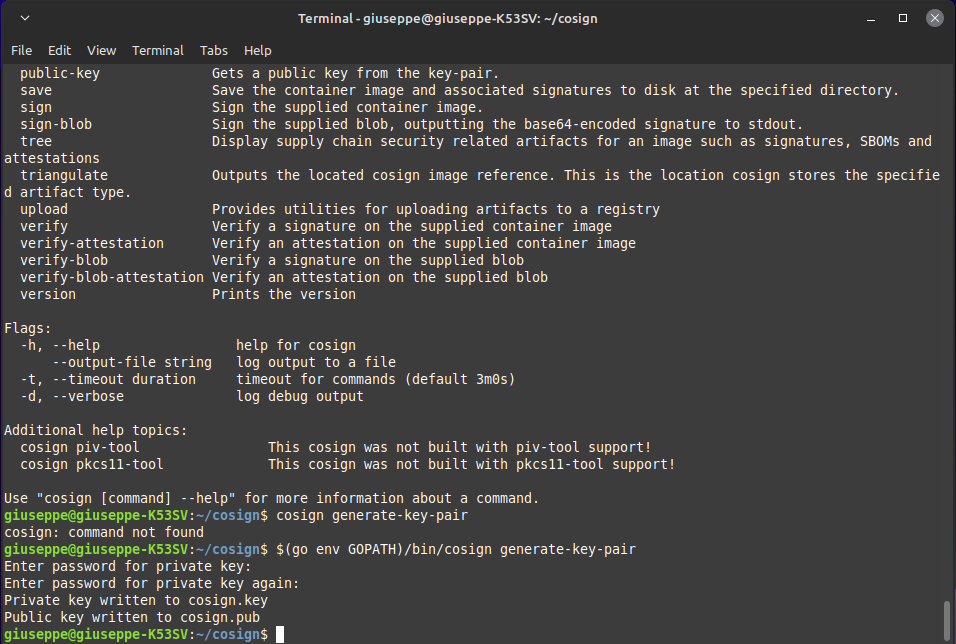
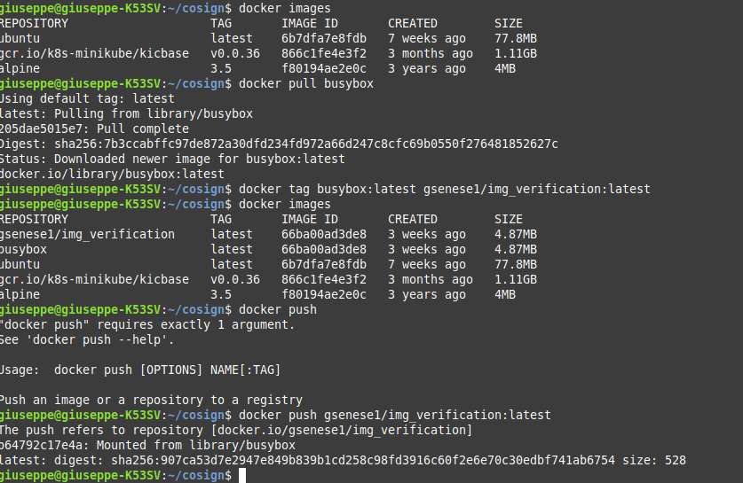
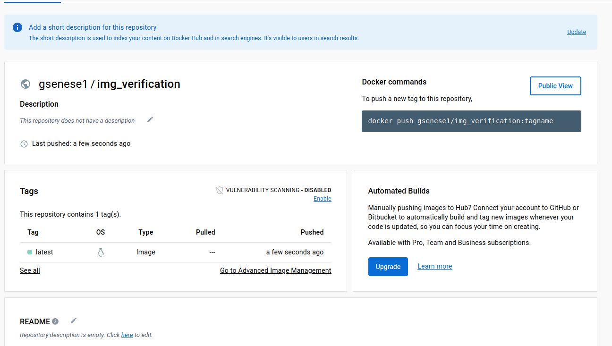
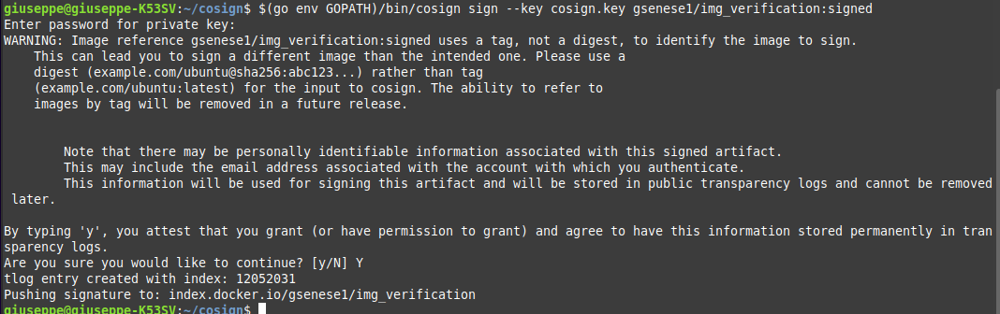
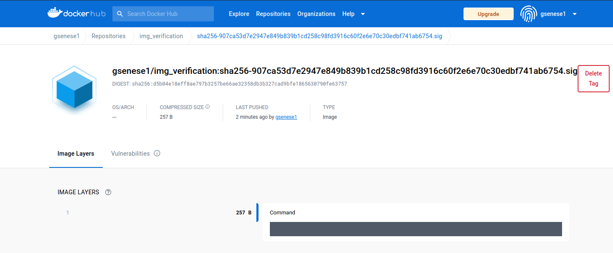
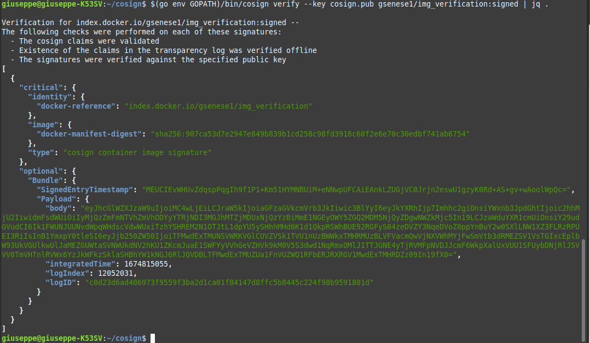
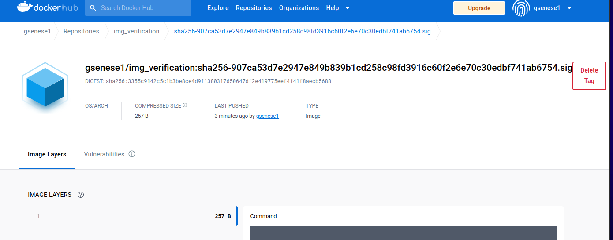
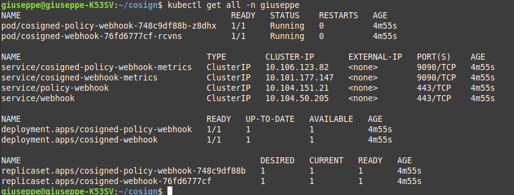
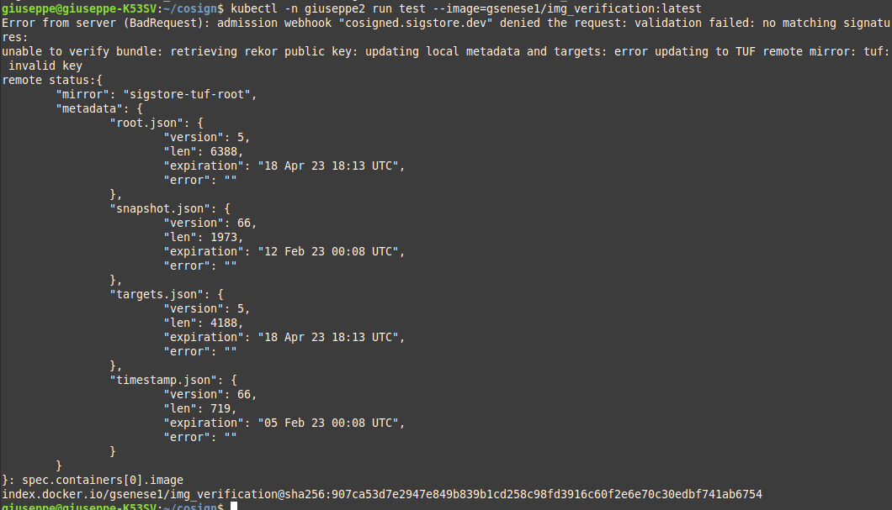

# Proof of Concept on Secure OCI Image Signature Verification and Alerts Automation

## Project Description

This READMI file explains the main steps of this POC test on container image security, it contains code snippets and links to guide you through it.

The project demonstrates how any OCI container image can be signed and published in Kubernetes clusters, along with blocking unsigned images in namespaces or sending warnings.
Integration with Sysdig events UI will complete the process.


## Download, Installations and Configurations

The list of open-source tools with links I have used for this POC directly on my personal computer are:

- **[Linux](https://www.linux.org/pages/download/)** distribution shell
- **[Minikube](https://kubernetes.io/docs/tutorials/kubernetes-basics/create-cluster/cluster-intro/)**, to create a Kubernetes cluster in your computer
- **[Cosign](https://www.sigstore.dev/)**, to sign a container and store signatures in an OCI registry generating a keypar (private and public)
- **[Connaisseur](https://sse-secure-systems.github.io/connaisseur/v2.7.0/)**, to integrate container image signature verification into a clusters
- **[Helm](https://helm.sh/)**, a package manager to automate Kubernetes packages deployment
- **[Sysdig](https://sysdig.com/)**, a security, monitoring and compliance solution for Containers.

<p align="left"> <a href="https://www.docker.com/" target="_blank" rel="noreferrer">  </a> <a href="https://kubernetes.io" target="_blank" rel="noreferrer">  </a> <a href="https://www.linux.org/" target="_blank" rel="noreferrer">  </a> <a href="https://nodejs.org" target="_blank" rel="noreferrer">   </a> </p>

## Configuration Steps

### 1. Install Minikube & Interact with Clusters on Shell

To install Minikube from your Linux shell:

```bash
curl -LO https://storage.googleapis.com/minikube/releases/latest/minikube-darwin-amd64
sudo install minikube-darwin-amd64 /usr/local/bin/minikube
```

Let's start your cluster:


```bash
minikube start
```

Download kubectl and use it:

```bash
minikube kubectl -- get po -A

```

### 2. Installing Cosign

Clone repository:

```bash
$ git clone https://github.com/sigstore/cosign
$ cd cosign
$ go install ./cmd/cosign
$ $(go env GOPATH)/bin/cosign

```
Generate the encrypted pair keys:

```bash
cosign generate-key-pair

```




### 3. Publish Image in OCI registry

Let's pull busybox from Docker and tag it to then push it in registry with the following commands:

```bash
docker pull busybox

```

```bash
docker tag busybox:latest gesenese1/img_verification:latest

```

```bash
docker push gesenese1/img_verification:latest

```

We should see an output like this:



Check in OCI tags if the image is signed:




### 3. Signing the Image


```bash
docker tag busybox:latest gesenese1/img_verification:signed

```

```bash
$(go env GOPATH)/bin/cosign sign --key cosign.key gesenese1/img_verification:signed

```





If we try to verify the signature:

```bash
docker push gesenese1/img_verification:signed

```








### 4. Deploy Signed Image to Kubernetes

Time to use automation tool Helm installing a Cosigned Admission Webhook, in order to verify that only signed images can run into the cluster:


```bash
kubectl get pod -n giuseppe

```


```bash
kubectl get all -n giuseppe

```




Now let us enable the webhook in needed namespaces:


```bash
kubectl label --overwrite namespace/giuseppe2 cosigned.sigstore.dev/include=true

```

With that the image fails as is not signed as this proof:




### 5. Connaisseur as Admission Controller

Let us get Connaisseur:


```bash
kubectl get all -n connaisseur

```


With this admission controller, we can decide which namespaces are going to be analyzed and also change between Alerting Only or Blocking the deployments.

By default, Connaisseur is configured to verify the signature for the official docker hub images and the project ones. We will configure it to also verify the ones signed with our generated keys.

Now we can run images signed with our previously generated cosign keys, we need to modify the connaisseur deployment.

Looking into the documentation, there’s a section where it is explained how to add your own public key. It’s as easy as going to the values.yaml file provided in the repo and modifying the default validator by adding our publicKey, changing the type to cosign and removing the host specification. The next picture shows an example of a modified file.


After that, deploy the chart with new values and you will be able to run you signed images.


## Integration with Sysdig

After creating a Sysdig account we can alert third-party applications, this is done via Connaisseur notification template system that allows integration API, modifying the value.yaml file replacing Sysdig Secure token, so in every request there will be an event generated automatically.


## Conclusion

Using Cosign allows us to easily deploy a system where no external services are needed and we can set our first level of trust. Cosign, along with Connaisseur, ensures that images running in our Kubernetes clusters have been verified with automated alerts using Sysdig.

<h2 align="left">Hi 👋, I'm Giuseppe Senese</h1>
<h3 align="left">A passionate cloud architect from Italy</h3>

<h3 align="left">Connect with me:</h3>
<p align="left">
<a href="https://linkedin.com/in/linkedin.com/in/giusen" target="blank"></a>
